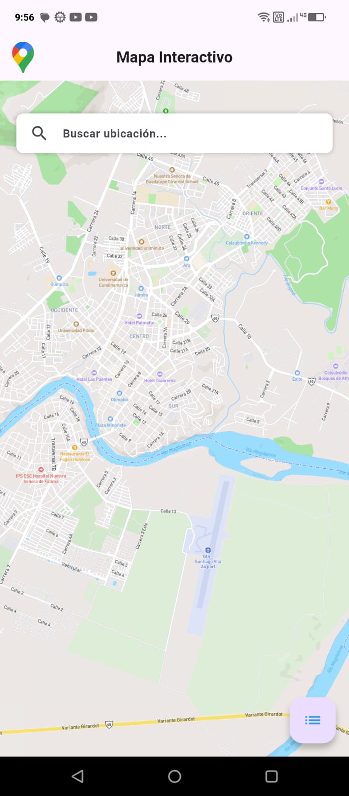

# mapa_interactivo

Mapa interactivo, agregar marcadores con informacion y busqueda de ubicaciones


## Requisitos previos

- Flutter SDK
- Dart
- Android Studio

## Instalacion

1. Crear una carpeta
2. Dirigirse a la ruta de la carpeta en cmd
3. Iniciar git en la carpeta con el comando ```git init```
4. Clonar el repositorio con el comando ```git clone https://github.com/Hannj0/Mapa_Interactivo.git```
5. Abrir la carpeta con android studio
6. Ejecutar el comando ```flutter pub get``` en la terminal para descargar las dependencias necesarias
7. Construir el apk para Android con el comando ```flutter build apk --release``` o en 
8. Y listo se creara la apk en la direccion mapa_interactivo\build\app\outputs\flutter-apk con el nombre app-release.apk

## Funciones

1. Pantalla Principal: Mapa Interactivo
   o Muestra un mapa interactivo utilizando mapbox.
   o Permite al usuario hacer zoom y desplazarse por el mapa.
   
2. Agrega marcadores
   o Al mantener presionada una ubicación en el mapa, agrega un marcador en esa posición.
   o Muestra un cuadro de diálogo (AlertDialog) para que el usuario asigne un nombre al marcador.
   
3. Lista de Marcadores
   o Al presionar el botón flotante muestra una lista de los marcadores guardados en un cuadro emergente.
   o Al seleccionar un marcador de la lista, el mapa redirige a la ubicación del marcador.
   o Al pulsar el icono de lápiz, permite la edición del nombre del marcador.
   o Al pulsar el icono de papelera, permite la eliminación del marcador.
   
4. Búsqueda de ubicaciones
   o Cuenta con una barra de búsqueda que permita al usuario buscar ubicaciones por nombre.
   o Centra el mapa en la ubicación encontrada y agrega un marcador automáticamente.
    
5. Persistencia de datos
   o Almacena con hive los marcadores de forma persistente para que estén disponibles al cerrar y reabrir la aplicación.
